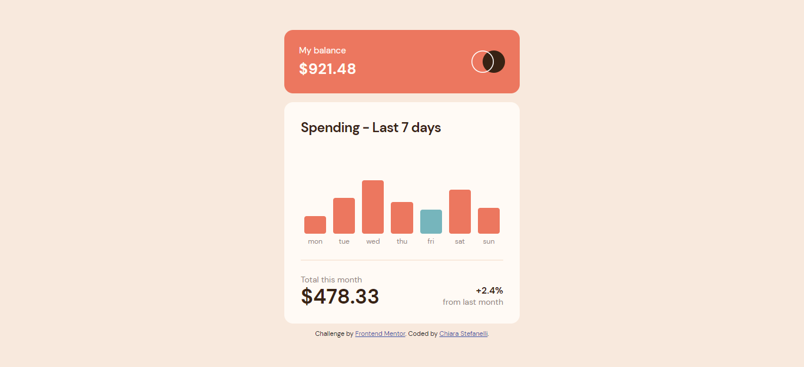

# Frontend Mentor - Expenses chart component solution

This is a solution to the [Expenses chart component challenge on Frontend Mentor](https://www.frontendmentor.io/challenges/expenses-chart-component-e7yJBUdjwt). Frontend Mentor challenges help you improve your coding skills by building realistic projects.

## Link

- [Project url](https://expenses-chart-frontend-mentor.netlify.app/) (hosted on Netlify)

## Screenshot

## The challenge

Users should be able to:

- View the bar chart and hover over the individual bars to see the correct amounts for each day
- See the current day’s bar highlighted in a different colour to the other bars
- View the optimal layout for the content depending on their device’s screen size
- See hover states for all interactive elements on the page
- Use the JSON data file provided to dynamically size the bars on the chart

I used Webpack to bundle the files.

## Built with

- Semantic HTML5 markup
- CSS custom properties and media queries
- JavaScript
- Sass
- Webpack

## Author

Chiara Stefanelli - Front-End Development Student based in Italy

- Website - [Chiara Stefanelli](https://chiarastefanelli.netlify.app/)
- LinkedIn - [Chiara Stefanelli](https://www.linkedin.com/in/chiarastefanelli/?locale=en_US)
- Frontend Mentor - [Chiara Stefanelli](https://www.frontendmentor.io/profile/chiarastef)
